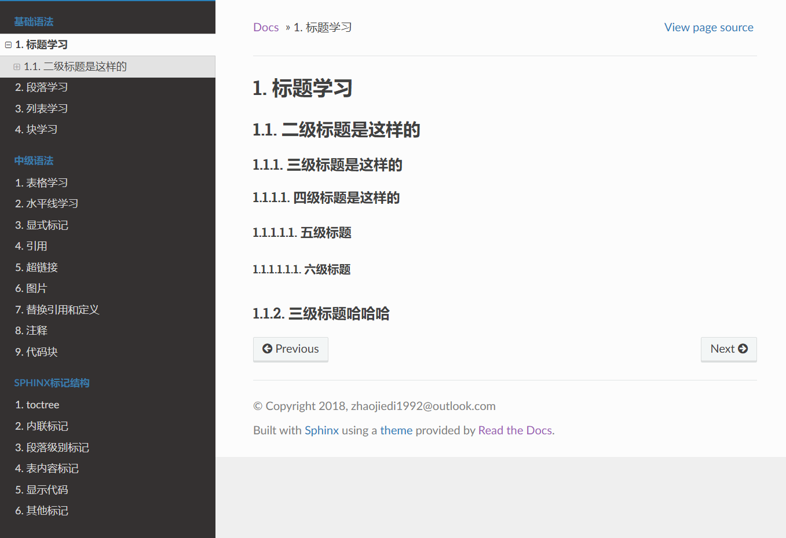

# reStructuredText格式文档模板



**运行demo的方式：**

1. 在项目根目录下执行

````js
./make clean /*清除*/

./make html /*转换为html*/
````

2. 打开根目录下的`build`/`html`/`index.html`即可在浏览器中运行相应的demo。

**文档模板demo在source文件夹下，主要内容是：**

**reStructuredText格式常用的写法**

**基础语法部分：**

1. 标题
2. 段落
3. 块
4. 列表
   
**中级语法部分：**

1. 表格
2. 超链接
3. 代码块
4. 水平线
5. 替换引用和定义
6. 图片
7. 显示标记
8. 引用
9. 注释

**Sphinx标记结构**

1. 表内容标记
2. 段落级别标记
3. 内联标记
4. 其他标记
5. 显示代码